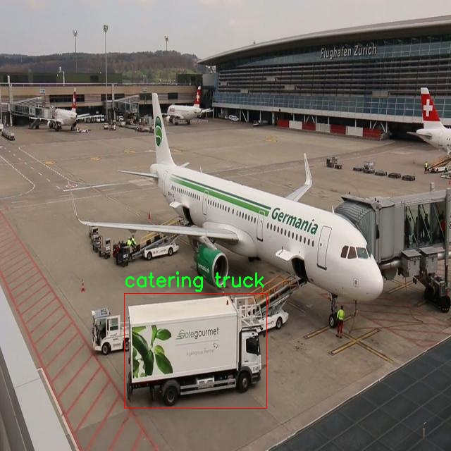

# 改进yolo11-ADown等200+全套创新点大全：机场设备检测系统源码＆数据集全套

### 1.图片效果展示


##### 项目来源 **[人工智能促进会 2024.10.22](https://kdocs.cn/l/cszuIiCKVNis)**

##### 注意：由于项目一直在更新迭代，上面“1.图片效果展示”和“2.视频效果展示”展示的系统图片或者视频可能为老版本，新版本在老版本的基础上升级如下：（实际效果以升级的新版本为准）

  （1）适配了YOLOV11的“目标检测”模型和“实例分割”模型，通过加载相应的权重（.pt）文件即可自适应加载模型。

  （2）支持“图片识别”、“视频识别”、“摄像头实时识别”三种识别模式。

  （3）支持“图片识别”、“视频识别”、“摄像头实时识别”三种识别结果保存导出，解决手动导出（容易卡顿出现爆内存）存在的问题，识别完自动保存结果并导出到tempDir中。

  （4）支持Web前端系统中的标题、背景图等自定义修改。

  另外本项目提供训练的数据集和训练教程,暂不提供权重文件（best.pt）,需要您按照教程进行训练后实现图片演示和Web前端界面演示的效果。

### 2.视频效果展示

[2.1 视频效果展示](https://www.bilibili.com/video/BV1yDyHYWE4G/)

### 3.背景

研究背景与意义

随着全球航空运输业的快速发展，机场作为航空运输的枢纽，其设备的高效管理与安全监控显得尤为重要。传统的机场设备监测方法往往依赖人工巡检，不仅效率低下，而且容易受到人为因素的影响，导致安全隐患的增加。因此，构建一个智能化的机场设备检测系统，能够实时监测和识别机场内的各种设备，已成为提升机场运营效率和安全性的重要手段。

本研究旨在基于改进的YOLOv11模型，开发一个高效的机场设备检测系统。YOLO（You Only Look Once）系列模型以其高速度和高准确率在目标检测领域取得了显著的成果。通过对YOLOv11进行改进，我们期望在保持其实时检测能力的基础上，进一步提升对机场特定设备的识别精度和鲁棒性。数据集“Airport_1”包含21张图像，涵盖了多种机场设备，如飞机、行李车、行李输送带卡车、餐饮车等，这些设备在机场的日常运营中扮演着重要角色。尽管数据集规模较小，但其类别的多样性为模型的训练和评估提供了良好的基础。

通过对该数据集的深入分析与处理，我们将为改进YOLOv11模型提供丰富的训练样本，帮助模型学习到不同设备的特征和变化，从而实现高效的目标检测。此外，系统的成功应用将为机场的设备管理提供智能化解决方案，降低人工成本，提高设备使用效率，增强机场的安全管理能力。综上所述，本研究不仅具有重要的理论意义，也将为实际应用提供有力支持，推动机场智能化管理的发展。

### 4.数据集信息展示

##### 4.1 本项目数据集详细数据（类别数＆类别名）

nc: 9
names: ['aircraft', 'bag trolley', 'bag trolley loaded', 'bag tug', 'baggage conveyor-belt truck', 'catering truck', 'cone', 'ground staff', 'uld trolley']


该项目为【目标检测】数据集，请在【训练教程和Web端加载模型教程（第三步）】这一步的时候按照【目标检测】部分的教程来训练

##### 4.2 本项目数据集信息介绍

本项目数据集信息介绍

本项目所使用的数据集名为“Airport_1”，旨在为改进YOLOv11的机场设备检测系统提供高质量的训练数据。该数据集包含九个类别，涵盖了机场运营中常见的设备和人员，具体类别包括：飞机、行李车、装载行李的行李车、行李拖车、行李传送带卡车、餐饮卡车、锥形标志、地面工作人员以及ULD（单位负载装置）拖车。这些类别的选择充分考虑了机场环境的复杂性和多样性，确保模型能够在实际应用中准确识别和分类不同的设备与人员。

数据集的构建过程中，采用了多种数据采集手段，包括高分辨率图像和视频的录制，确保捕捉到不同角度和光照条件下的机场设备。这种多样化的数据来源不仅增强了模型的泛化能力，还提高了其在真实场景中的适应性。此外，数据集中的每个类别都经过精确标注，确保训练过程中模型能够学习到每个类别的特征和细节，从而提升检测精度。

“Airport_1”数据集的设计目标是为YOLOv11模型提供丰富的训练素材，使其能够在机场环境中高效、准确地识别和定位各种设备与工作人员。通过对这些类别的深入学习，模型将能够有效支持机场的运营管理，提高工作效率，并保障乘客的安全与便利。整体而言，该数据集不仅是技术实现的基础，更是推动机场智能化管理的重要一步。





### 5.全套项目环境部署视频教程（零基础手把手教学）

[5.1 所需软件PyCharm和Anaconda安装教程（第一步）](https://www.bilibili.com/video/BV1BoC1YCEKi/?spm_id_from=333.999.0.0&vd_source=bc9aec86d164b67a7004b996143742dc)


[5.2 安装Python虚拟环境创建和依赖库安装视频教程（第二步）](https://www.bilibili.com/video/BV1ZoC1YCEBw?spm_id_from=333.788.videopod.sections&vd_source=bc9aec86d164b67a7004b996143742dc)

### 6.改进YOLOv11训练教程和Web_UI前端加载模型教程（零基础手把手教学）

[6.1 改进YOLOv11训练教程和Web_UI前端加载模型教程（第三步）](https://www.bilibili.com/video/BV1BoC1YCEhR?spm_id_from=333.788.videopod.sections&vd_source=bc9aec86d164b67a7004b996143742dc)


按照上面的训练视频教程链接加载项目提供的数据集，运行train.py即可开始训练



     Epoch   gpu_mem       box       obj       cls    labels  img_size
     1/200     20.8G   0.01576   0.01955  0.007536        22      1280: 100%|██████████| 849/849 [14:42<00:00,  1.04s/it]
               Class     Images     Labels          P          R     mAP@.5 mAP@.5:.95: 100%|██████████| 213/213 [01:14<00:00,  2.87it/s]
                 all       3395      17314      0.994      0.957      0.0957      0.0843

     Epoch   gpu_mem       box       obj       cls    labels  img_size
     2/200     20.8G   0.01578   0.01923  0.007006        22      1280: 100%|██████████| 849/849 [14:44<00:00,  1.04s/it]
               Class     Images     Labels          P          R     mAP@.5 mAP@.5:.95: 100%|██████████| 213/213 [01:12<00:00,  2.95it/s]
                 all       3395      17314      0.996      0.956      0.0957      0.0845

     Epoch   gpu_mem       box       obj       cls    labels  img_size
     3/200     20.8G   0.01561    0.0191  0.006895        27      1280: 100%|██████████| 849/849 [10:56<00:00,  1.29it/s]
               Class     Images     Labels          P          R     mAP@.5 mAP@.5:.95: 100%|███████   | 187/213 [00:52<00:00,  4.04it/s]
                 all       3395      17314      0.996      0.957      0.0957      0.0845


###### [项目数据集下载链接](https://kdocs.cn/l/cszuIiCKVNis)

### 7.原始YOLOv11算法讲解


ultralytics发布了最新的作品YOLOv11，这一次YOLOv11的变化相对于ultralytics公司的上一代作品YOLOv8变化不是很大的（YOLOv9、YOLOv10均不是ultralytics公司作品），其中改变的位置涉及到C2f变为C3K2，在SPPF后面加了一层类似于注意力机制的C2PSA，还有一个变化大家从yaml文件是看不出来的就是它的检测头内部替换了两个DWConv，以及模型的深度和宽度参数进行了大幅度调整，但是在损失函数方面就没有变化还是采用的CIoU作为边界框回归损失，下面带大家深入理解一下ultralytics最新作品YOLOv11的创新点。

**下图为最近的YOLO系列发布时间线！**


* * *

###### YOLOv11和YOLOv8对比

在YOLOYOLOv5，YOLOv8，和YOLOv11是ultralytics公司作品（ultralytics出品必属精品），下面用一张图片从yaml文件来带大家对比一下YOLOv8和YOLOv11的区别，配置文件变得内容比较少大家可以看一卡，左侧为YOLOv8右侧为YOLOv11，不同的点我用黑线标注了出来。


* * *

###### YOLOv11的网络结构解析

下面的图片为YOLOv11的网络结构图。


**其中主要创新点可以总结如下- > **

* * *

1\.
提出C3k2机制，其中C3k2有参数为c3k，其中在网络的浅层c3k设置为False（下图中可以看到c3k2第二个参数被设置为False，就是对应的c3k参数）。


此时所谓的C3k2就相当于YOLOv8中的C2f，其网络结构为一致的，其中的C3k机制的网络结构图如下图所示
**（为什么叫C3k2，我个人理解是因为C3k的调用时C3k其中的参数N固定设置为2的原因，个人理解不一定对** ）。


* * *

2\.
第二个创新点是提出C2PSA机制，这是一个C2（C2f的前身）机制内部嵌入了一个多头注意力机制，在这个过程中我还发现作者尝试了C2fPSA机制但是估计效果不如C2PSA，有的时候机制有没有效果理论上真的很难解释通，下图为C2PSA机制的原理图，仔细观察把Attention哪里去掉则C2PSA机制就变为了C2所以我上面说C2PSA就是C2里面嵌入了一个PSA机制。


* * *

3\.
第三个创新点可以说是原先的解耦头中的分类检测头增加了两个DWConv，具体的对比大家可以看下面两个图下面的是YOLOv11的解耦头，上面的是YOLOv8的解耦头.


我们上面看到了在分类检测头中YOLOv11插入了两个DWConv这样的做法可以大幅度减少参数量和计算量（原先两个普通的Conv大家要注意到卷积和是由3变为了1的，这是形成了两个深度可分离Conv），大家可能不太理解为什么加入了两个DWConv还能够减少计算量，以及什么是深度可分离Conv，下面我来解释一下。

> **`DWConv` 代表 Depthwise
> Convolution（深度卷积）**，是一种在卷积神经网络中常用的高效卷积操作。它主要用于减少计算复杂度和参数量，尤其在移动端或轻量化网络（如
> MobileNet）中十分常见。
>
> **1\. 标准卷积的计算过程**
>
> 在标准卷积操作中，对于一个输入张量（通常是一个多通道的特征图），卷积核的尺寸是 `(h, w, C_in)`，其中 `h` 和 `w`
> 是卷积核的空间尺寸，`C_in`
> 是输入通道的数量。而卷积核与输入张量做的是完整的卷积运算，每个输出通道都与所有输入通道相连并参与卷积操作，导致计算量比较大。
>
> 标准卷积的计算过程是这样的：
>
>   * 每个输出通道是所有输入通道的组合（加权求和），卷积核在每个位置都会计算与所有输入通道的点积。
>   * 假设有 `C_in` 个输入通道和 `C_out` 个输出通道，那么卷积核的总参数量是 `C_in * C_out * h * w`。
>

>
> 2\. **Depthwise Convolution（DWConv）**
>
> 与标准卷积不同， **深度卷积** 将输入的每个通道单独处理，即 **每个通道都有自己的卷积核进行卷积**
> ，不与其他通道进行交互。它可以被看作是标准卷积的一部分，专注于空间维度上的卷积运算。
>
> **深度卷积的计算过程：**
>
>   * 假设输入张量有 `C_in` 个通道，每个通道会使用一个 `h × w`
> 的卷积核进行卷积操作。这个过程称为“深度卷积”，因为每个通道独立进行卷积运算。
>   * 输出的通道数与输入通道数一致，每个输出通道只和对应的输入通道进行卷积，没有跨通道的组合。
>   * 参数量和计算量相比标准卷积大大减少，卷积核的参数量是 `C_in * h * w`。
>

>
> **深度卷积的优点：**
>
>   1. **计算效率高** ：相对于标准卷积，深度卷积显著减少了计算量。它只处理空间维度上的卷积，不再处理通道间的卷积。
>   2.  **参数量减少** ：由于每个卷积核只对单个通道进行卷积，参数量大幅减少。例如，标准卷积的参数量为 `C_in * C_out * h *
> w`，而深度卷积的参数量为 `C_in * h * w`。
>   3.  **结合点卷积可提升效果** ：为了弥补深度卷积缺乏跨通道信息整合的问题，通常深度卷积后会配合 `1x1` 的点卷积（Pointwise
> Convolution）使用，通过 `1x1` 的卷积核整合跨通道的信息。这种组合被称为 **深度可分离卷积** （Depthwise
> Separable Convolution） | **这也是我们本文YOLOv11中的做法** 。
>

>
> 3\. **深度卷积与标准卷积的区别**
>
> 操作类型| 卷积核大小| 输入通道数| 输出通道数| 参数量  
> ---|---|---|---|---  
> 标准卷积| `h × w`| `C_in`| `C_out`| `C_in * C_out * h * w`  
> 深度卷积（DWConv）| `h × w`| `C_in`| `C_in`| `C_in * h * w`  
>  
> 可以看出，深度卷积在相同的卷积核大小下，参数量减少了约 `C_out` 倍
> （细心的人可以发现用最新版本的ultralytics仓库运行YOLOv8参数量相比于之前的YOLOv8以及大幅度减少了这就是因为检测头改了的原因但是名字还是Detect，所以如果你想继续用YOLOv8发表论文做实验那么不要更新最近的ultralytics仓库）。
>
> **4\. 深度可分离卷积 (Depthwise Separable Convolution)**
>
> 深度卷积常与 `1x1` 的点卷积配合使用，这称为深度可分离卷积。其过程如下：
>
>   1. 先对输入张量进行深度卷积，对每个通道独立进行空间卷积。
>   2. 然后通过 `1x1` 点卷积，对通道维度进行混合，整合不同通道的信息。
>

>
> 这样既可以保证计算量的减少，又可以保持跨通道的信息流动。
>
> 5\. **总结**
>
> `DWConv` 是一种高效的卷积方式，通过单独处理每个通道来减少计算量，结合 `1x1`
> 的点卷积，形成深度可分离卷积，可以在保持网络性能的同时极大地减少模型的计算复杂度和参数量。

**看到这里大家应该明白了为什么加入了两个DWConv还能减少参数量以及YOLOv11的检测头创新点在哪里。**

* * *

##### YOLOv11和YOLOv8还有一个不同的点就是其各个版本的模型（N - S - M- L - X）网络深度和宽度变了


可以看到在深度（depth）和宽度
（width）两个地方YOLOv8和YOLOv11是基本上完全不同了，这里我理解这么做的含义就是模型网络变小了，所以需要加深一些模型的放缩倍数来弥补模型之前丧失的能力从而来达到一个平衡。

> **本章总结：**
> YOLOv11的改进点其实并不多更多的都是一些小的结构上的创新，相对于之前的YOLOv5到YOLOv8的创新，其实YOLOv11的创新点不算多，但是其是ultralytics公司的出品，同时ultralytics仓库的使用量是非常多的（不像YOLOv9和YOLOv10）所以在未来的很长一段时间内其实YOLO系列估计不会再更新了，YOLOv11作为最新的SOTA肯定是十分适合大家来发表论文和创新的。
>

### 8.200+种全套改进YOLOV11创新点原理讲解

#### 8.1 200+种全套改进YOLOV11创新点原理讲解大全

由于篇幅限制，每个创新点的具体原理讲解就不全部展开，具体见下列网址中的改进模块对应项目的技术原理博客网址【Blog】（创新点均为模块化搭建，原理适配YOLOv5~YOLOv11等各种版本）

[改进模块技术原理博客【Blog】网址链接](https://gitee.com/qunmasj/good)


#### 8.2 精选部分改进YOLOV11创新点原理讲解

###### 这里节选部分改进创新点展开原理讲解(完整的改进原理见上图和[改进模块技术原理博客链接](https://gitee.com/qunmasj/good)【如果此小节的图加载失败可以通过CSDN或者Github搜索该博客的标题访问原始博客，原始博客图片显示正常】


### D-LKA Attention简介
自2010年代中期以来，卷积神经网络（CNNs）已成为许多计算机视觉应用的首选技术。它们能够从原始数据中自动提取复杂的特征表示，无需手动进行特征工程，这引起了医学图像分析社区的极大兴趣。许多成功的CNN架构，如U-Net、全卷积网络、DeepLab或SegCaps（分割胶囊），已经被开发出来。这些架构在语义分割任务中取得了巨大成功，先前的最新方法已经被超越。

在计算机视觉研究中，不同尺度下的目标识别是一个关键问题。在CNN中，可检测目标的大小与相应网络层的感受野尺寸密切相关。如果一个目标扩展到超出这个感受野的边界，这可能会导致欠分割结果。相反，与目标实际大小相比使用过大的感受野可能会限制识别，因为背景信息可能会对预测产生不必要的影响。

解决这个问题的一个有希望的方法涉及在并行使用具有不同尺寸的多个Kernel，类似于Inception块的机制。然而，由于参数和计算要求的指数增长，将Kernel大小增加以容纳更大的目标在实践中受到限制。因此，出现了各种策略，包括金字塔池化技术和不同尺度的扩张卷积，以捕获多尺度的上下文信息。

另一个直观的概念涉及将多尺度图像金字塔或它们的相关特征表示直接纳入网络架构。然而，这种方法存在挑战，特别是在管理训练和推理时间方面的可行性方面存在挑战。在这个背景下，使用编码器-解码器网络，如U-Net，已被证明是有利的。这样的网络在较浅的层中编码外观和位置，而在更深的层中，通过神经元的更广泛的感受野捕获更高的语义信息和上下文信息。

一些方法将来自不同层的特征组合在一起，或者预测来自不同尺寸的层的特征以使用多尺度的信息。此外，出现了从不同尺度的层中预测特征的方法，有效地实现了跨多个尺度的见解整合。然而，大多数编码器-解码器结构面临一个挑战：它们经常无法在不同尺度之间保持一致的特征，并主要使用最后一个解码器层生成分割结果。

语义分割是一项任务，涉及根据预定义的标签集为图像中的每个像素预测语义类别。这项任务要求提取高级特征同时保留初始的空间分辨率。CNNs非常适合捕获局部细节和低级信息，尽管以忽略全局上下文为代价。视觉Transformer（ViT）架构已经成为解决处理全局信息的视觉任务的关键，包括语义分割，取得了显著的成功。

ViT的基础是注意力机制，它有助于在整个输入序列上聚合信息。这种能力使网络能够合并远程的上下文提示，超越了CNN的有限感受野尺寸。然而，这种策略通常会限制ViT有效建模局部信息的能力。这种局限可能会妨碍它们检测局部纹理的能力，这对于各种诊断和预测任务至关重要。这种缺乏局部表示可以归因于ViT模型处理图像的特定方式。

ViT模型将图像分成一系列Patch，并使用自注意力机制来模拟它们之间的依赖关系。这种方法可能不如CNN模型中的卷积操作对感受野内提取局部特征有效。ViT和CNN模型之间的这种图像处理方法的差异可能解释了CNN模型在局部特征提取方面表现出色的原因。

近年来，已经开发出创新性方法来解决Transformer模型内部局部纹理不足的问题。其中一种方法是通过互补方法将CNN和ViT特征结合起来，以结合它们的优势并减轻局部表示的不足。TransUNet是这种方法的早期示例，它在CNN的瓶颈中集成了Transformer层，以模拟局部和全局依赖关系。HiFormer提出了一种解决方案，将Swin Transformer模块和基于CNN的编码器结合起来，生成两个多尺度特征表示，通过Double-Level Fusion模块集成。UNETR使用基于Transformer的编码器和CNN解码器进行3D医学图像分割。CoTr和TransBTS通过Transformer在低分辨率阶段增强分割性能，将CNN编码器和解码器连接在一起。

增强局部特征表示的另一种策略是重新设计纯Transformer模型内部的自注意力机制。在这方面，Swin-Unet在U形结构中集成了一个具有线性计算复杂性的Swin Transformer块作为多尺度 Backbone 。MISSFormer采用高效Transformer来解决视觉Transformer中的参数问题，通过在输入块上进行不可逆的降采样操作。D-Former引入了一个纯Transformer的管道，具有双重注意模块，以分段的方式捕获细粒度的局部注意和与多元单元的交互。然而，仍然存在一些特定的限制，包括计算效率低下，如TransUNet模型所示，对CNN Backbone 的严重依赖，如HiFormer所观察到的，以及对多尺度信息的忽略。

此外，目前的分割架构通常采用逐层处理3D输入 volumetric 的方法，无意中忽视了相邻切片之间的潜在相关性。这一疏忽限制了对 volumetric 信息的全面利用，因此损害了定位精度和上下文集成。此外，必须认识到，医学领域的病变通常在形状上发生变形。因此，用于医学图像分析的任何学习算法都必须具备捕捉和理解这些变形的能力。与此同时，该算法应保持计算效率，以便处理3D volumetric数据。

为了解决上述提到的挑战，作者提出了一个解决方案，即可变形大卷积核注意力模块（Deformable LKA module），它是作者网络设计的基本构建模块。这个模块明确设计成在有效处理上下文信息的同时保留局部描述符。作者的架构在这两个方面的平衡增强了实现精确语义分割的能力。

值得注意的是，参考该博客引入了一种基于数据的感受野的动态适应，不同于传统卷积操作中的固定滤波器Mask。这种自适应方法使作者能够克服与静态方法相关的固有限制。这种创新方法还扩展到了D-LKA Net架构的2D和3D版本的开发。

在3D模型的情况下，D-LKA机制被量身定制以适应3D环境，从而实现在不同 volumetric 切片之间无缝信息交互。最后，作者的贡献通过其计算效率得到进一步强调。作者通过仅依靠D-LKA概念的设计来实现这一点，在各种分割基准上取得了显著的性能，确立了作者的方法作为一种新的SOTA方法。

在本节中，作者首先概述方法论。首先，作者回顾了由Guo等人引入的大卷积核注意力（Large Kernel Attention，LKA）的概念。然后，作者介绍了作者对可变形LKA模块的创新探索。在此基础上，作者介绍了用于分割任务的2D和3D网络架构。

大卷积核提供了与自注意力机制类似的感受野。可以通过使用深度卷积、深度可扩展卷积和卷积来构建大卷积核，从而减少了参数和计算量。构建输入维度为和通道数的卷积核的深度卷积和深度可扩展卷积的卷积核大小的方程如下：


具有卷积核大小和膨胀率。参数数量和浮点运算（FLOPs）的计算如下：


FLOPs的数量与输入图像的大小成线性增长。参数的数量随通道数和卷积核大小的增加而呈二次增长。然而，由于它们通常都很小，因此它们不是限制因素。

为了最小化对于固定卷积核大小K的参数数量，可以将方程3对于膨胀率的导数设定为零：


例如，当卷积核大小为时，结果是。将这些公式扩展到3D情况是直接的。对于大小为和通道数C的输入，3D情况下参数数量和FLOPs 的方程如下：


具有卷积核大小和膨胀。


利用大卷积核进行医学图像分割的概念通过引入可变形卷积得以扩展。可变形卷积可以通过整数偏移自由调整采样网格以进行自由变形。额外的卷积层从特征图中学习出变形，从而创建一个偏移场。基于特征本身学习变形会导致自适应卷积核。这种灵活的卷积核形状可以提高病变或器官变形的表示，从而增强了目标边界的定义。

负责计算偏移的卷积层遵循其相应卷积层的卷积核大小和膨胀。双线性插值用于计算不在图像网格上的偏移的像素值。如图2所示，D-LKA模块可以表示为：


其中输入特征由表示，。表示为注意力图，其中每个值表示相应特征的相对重要性。运算符  表示逐元素乘法运算。值得注意的是，LKA不同于传统的注意力方法，它不需要额外的规范化函数，如或。这些规范化函数往往忽视高频信息，从而降低了基于自注意力的方法的性能。

在该方法的2D版本中，卷积层被可变形卷积所替代，因为可变形卷积能够改善对具有不规则形状和大小的目标的捕捉能力。这些目标在医学图像数据中常常出现，因此这种增强尤为重要。

然而，将可变形LKA的概念扩展到3D领域会带来一定的挑战。主要的约束来自于需要用于生成偏移的额外卷积层。与2D情况不同，由于输入和输出通道的性质，这一层无法以深度可分的方式执行。在3D环境中，输入通道对应于特征，而输出通道扩展到，其中是卷积核的大小。大卷积核的复杂性导致沿第3D的通道数扩展，导致参数和FLOPs大幅增加。因此，针对3D情况采用了另一种替代方法。在现有的LKA框架中，深度卷积之后引入了一个单独的可变形卷积层。这种战略性的设计调整旨在减轻扩展到3D领域所带来的挑战。


2D网络的架构如图1所示。第一变种使用MaxViT作为编码器组件，用于高效特征提取，而第二变种则结合可变形LKA层进行更精细、卓越的分割。

在更正式的描述中，编码器生成4个分层输出表示。首先，卷积干扰将输入图像的维度减小到。随后，通过4个MaxViT块的4个阶段进行特征提取，每个阶段后跟随降采样层。随着过程进展到解码器，实施了4个阶段的D-LKA层，每个阶段包含2个D-LKA块。然后，应用Patch扩展层以实现分辨率上采样，同时减小通道维度。最后，线性层负责生成最终的输出。

2D D-LKA块的结构包括LayerNorm、可变形LKA和多层感知器（MLP）。积分残差连接确保了有效的特征传播，即使在更深层也是如此。这个安排可以用数学方式表示为：


其中输入特征，层归一化LN，可变形LKA注意力，深度卷积，线性层和GeLU激活函数。

3D网络架构如图1所示，采用编码器-解码器设计进行分层结构化。首先，一个Patch嵌入层将输入图像的维度从（）减小到（）。在编码器中，采用了3个D-LKA阶段的序列，每个阶段包含3个D-LKA块。在每个阶段之后，通过降采样步骤将空间分辨率减半，同时将通道维度加倍。中央瓶颈包括另一组2个D-LKA块。解码器结构与编码器相对称。

为了将特征分辨率加倍，同时减少通道数，使用转置卷积。每个解码器阶段都使用3个D-LKA块来促进远距离特征依赖性。最终的分割输出由一个卷积层产生，后面跟随一个卷积层以匹配特定类别的通道要求。

为了建立输入图像和分割输出之间的直接连接，使用卷积形成了一个跳跃连接。额外的跳跃连接根据简单的加法对来自其他阶段的特征进行融合。最终的分割图是通过和卷积层的组合产生的。

3D D-LKA块包括层归一化，后跟D-LKA注意力，应用了残差连接的部分。随后的部分采用了一个卷积层，后面跟随一个卷积层，两者都伴随着残差连接。这个整个过程可以总结如下：


带有输入特征 、层归一化 、可变形 LKA 、卷积层 和输出特征 的公式。是指一个前馈网络，包括2个卷积层和激活函数。

表7显示了普通卷积和构建卷积的参数数量比较。尽管标准卷积的参数数量在通道数较多时急剧增加，但分解卷积的参数总体较低，并且增长速度不那么快。

与分解卷积相比，可变形分解卷积增加了大量参数，但仍然明显小于标准卷积。可变形卷积的主要参数是由偏移网络创建的。在这里，作者假设可变形深度卷积的Kernel大小为（5,5），可变形深度空洞卷积的Kernel大小为（7,7）。这导致了21×21大小的大Kernel的最佳参数数量。更高效地生成偏移量的方法将大大减少参数数量。


值得注意的是，引入可变形LKA确实会增加模型的参数数量和每秒的浮点运算次数（FLOPS）。然而，重要的是强调，这增加的计算负载不会影响作者模型的整体推理速度。

相反，对于Batch-size > 1，作者甚至观察到推理时间的减少，如图7所示。例如，基于作者的广泛实验，作者观察到对于Batch-size为16，具有可变形卷积和没有可变形卷积的推理时间分别为8.01毫秒和17.38毫秒。作者认为这是由于在2D中对可变形卷积的高效实现所致。为了测量时间，使用了大小为（）的随机输入。在GPU热身周期50次迭代之后，网络被推断了1000次。测量是在NVIDIA RTX 3090 GPU上进行的。


为了充分利用性能与参数之间的权衡关系，作者在图8中可视化了在Synapse 2D数据集上报告的DSC和HD性能以及基于参数数量的内存消耗。D-LKA Net引入了相当多的参数，约为101M。这比性能第二好的方法ScaleFormer使用的111.6M参数要少。

与更轻量级的DAEFormer模型相比，作者实现了更好的性能，这证明了参数增加的合理性。大多数参数来自于MaxViT编码器；因此，将编码器替换为更高效的编码器可以减少模型参数。值得注意的是，在此可视化中，作者最初将HD和内存值都归一化到[0, 100]范围内。随后，作者将它们从100缩小，以增强更高值的表示。


### 9.系统功能展示

图9.1.系统支持检测结果表格显示

  图9.2.系统支持置信度和IOU阈值手动调节

  图9.3.系统支持自定义加载权重文件best.pt(需要你通过步骤5中训练获得)

  图9.4.系统支持摄像头实时识别

  图9.5.系统支持图片识别

  图9.6.系统支持视频识别

  图9.7.系统支持识别结果文件自动保存

  图9.8.系统支持Excel导出检测结果数据


### 10. YOLOv11核心改进源码讲解

#### 10.1 TransNext.py

下面是对你提供的代码进行逐行分析，并保留核心部分，同时添加详细的中文注释：

```python
try:
    # 尝试导入 swattention 模块和 TransNext_cuda 中的所有内容
    import swattention
    from ultralytics.nn.backbone.TransNeXt.TransNext_cuda import *
except ImportError as e:
    # 如果导入失败（例如，模块不存在），则导入 TransNext_native 中的所有内容
    from ultralytics.nn.backbone.TransNeXt.TransNext_native import *
    pass
```

### 核心部分分析：
1. **导入模块**：代码首先尝试导入 `swattention` 模块和 `TransNext_cuda` 中的内容，这表明程序可能依赖于 GPU 加速的实现。
2. **异常处理**：使用 `try...except` 结构来处理可能的导入错误，这种方式可以确保即使在某些环境中缺少特定模块，程序仍然能够运行，虽然可能会退回到一个较慢的实现（`TransNext_native`）。

### 精简后的核心代码：
```python
try:
    import swattention  # 尝试导入 swattention 模块
    from ultralytics.nn.backbone.TransNeXt.TransNext_cuda import *  # 尝试导入 CUDA 加速的 TransNext
except ImportError:
    from ultralytics.nn.backbone.TransNeXt.TransNext_native import *  # 导入 CPU 版本的 TransNext
```

### 详细注释：
- `import swattention`：尝试导入 `swattention` 模块，可能用于实现某种注意力机制。
- `from ultralytics.nn.backbone.TransNeXt.TransNext_cuda import *`：尝试从 `TransNext_cuda` 中导入所有定义，假设这是一个优化过的版本，能够利用 CUDA 加速计算。
- `except ImportError:`：捕获导入错误，如果上述模块未能成功导入，则执行以下代码。
- `from ultralytics.nn.backbone.TransNeXt.TransNext_native import *`：如果 CUDA 版本不可用，则导入 `TransNext_native`，这是一个不依赖于 CUDA 的实现，确保程序在没有 GPU 的环境中也能运行。

这样处理的好处是增强了代码的兼容性，使其能够在不同的硬件环境中灵活运行。

这个文件名为 `TransNext.py`，其主要功能是尝试导入一个名为 `swattention` 的模块，并根据导入的结果选择不同的后端实现。

首先，代码使用 `try` 语句块来尝试导入 `swattention` 模块和 `TransNext_cuda` 中的内容。如果导入成功，程序将继续使用 CUDA 版本的 `TransNext` 实现。这通常意味着程序会利用 GPU 加速来提高计算性能，因为 CUDA 是 NVIDIA 提供的并行计算平台和编程模型。

如果在导入过程中发生 `ImportError`，这表明 `swattention` 模块未能成功导入，可能是因为该模块不存在或未正确安装。在这种情况下，程序会进入 `except` 块，导入 `TransNext_native` 中的内容。这通常意味着程序将回退到 CPU 版本的实现，尽管可能会牺牲一些性能，但可以确保程序在没有 GPU 支持的环境中仍然能够运行。

总的来说，这段代码实现了对不同后端实现的动态选择，以确保在不同的运行环境中都能正常工作。这种设计方式提高了代码的灵活性和兼容性。

#### 10.2 CSwomTramsformer.py

以下是代码中最核心的部分，并附上详细的中文注释：

```python
import torch
import torch.nn as nn
import numpy as np

class Mlp(nn.Module):
    """多层感知机（MLP）模块"""
    def __init__(self, in_features, hidden_features=None, out_features=None, act_layer=nn.GELU, drop=0.):
        super().__init__()
        out_features = out_features or in_features  # 输出特征数
        hidden_features = hidden_features or in_features  # 隐藏层特征数
        self.fc1 = nn.Linear(in_features, hidden_features)  # 第一层线性变换
        self.act = act_layer()  # 激活函数
        self.fc2 = nn.Linear(hidden_features, out_features)  # 第二层线性变换
        self.drop = nn.Dropout(drop)  # Dropout层

    def forward(self, x):
        """前向传播"""
        x = self.fc1(x)  # 线性变换
        x = self.act(x)  # 激活
        x = self.drop(x)  # Dropout
        x = self.fc2(x)  # 线性变换
        x = self.drop(x)  # Dropout
        return x

class LePEAttention(nn.Module):
    """局部增强注意力（LePE）模块"""
    def __init__(self, dim, resolution, idx, split_size=7, num_heads=8, attn_drop=0.):
        super().__init__()
        self.dim = dim  # 输入特征维度
        self.resolution = resolution  # 输入分辨率
        self.split_size = split_size  # 切分窗口大小
        self.num_heads = num_heads  # 注意力头数
        head_dim = dim // num_heads  # 每个头的维度
        self.scale = head_dim ** -0.5  # 缩放因子
        self.get_v = nn.Conv2d(dim, dim, kernel_size=3, stride=1, padding=1, groups=dim)  # 用于获取v的卷积层
        self.attn_drop = nn.Dropout(attn_drop)  # 注意力Dropout层

    def im2cswin(self, x):
        """将输入张量转换为窗口格式"""
        B, N, C = x.shape  # B: 批量大小, N: 序列长度, C: 特征维度
        H = W = int(np.sqrt(N))  # 计算高度和宽度
        x = x.transpose(-2, -1).contiguous().view(B, C, H, W)  # 转换为图像格式
        x = img2windows(x, self.split_size, self.split_size)  # 切分为窗口
        return x

    def forward(self, qkv):
        """前向传播"""
        q, k, v = qkv  # 获取查询、键、值
        q = self.im2cswin(q)  # 将q转换为窗口格式
        k = self.im2cswin(k)  # 将k转换为窗口格式
        v = self.get_v(v)  # 通过卷积获取v
        q = q * self.scale  # 应用缩放因子
        attn = (q @ k.transpose(-2, -1))  # 计算注意力分数
        attn = nn.functional.softmax(attn, dim=-1)  # 归一化
        attn = self.attn_drop(attn)  # 应用Dropout
        x = attn @ v  # 加权求和
        return x

class CSWinBlock(nn.Module):
    """CSWin Transformer的基本块"""
    def __init__(self, dim, reso, num_heads, split_size=7, mlp_ratio=4.):
        super().__init__()
        self.dim = dim  # 输入特征维度
        self.num_heads = num_heads  # 注意力头数
        self.qkv = nn.Linear(dim, dim * 3)  # 线性层用于生成q, k, v
        self.attn = LePEAttention(dim, resolution=reso, idx=0, split_size=split_size, num_heads=num_heads)  # 注意力层
        self.mlp = Mlp(in_features=dim, hidden_features=int(dim * mlp_ratio), out_features=dim)  # MLP层

    def forward(self, x):
        """前向传播"""
        qkv = self.qkv(x).reshape(x.shape[0], -1, 3, self.dim).permute(2, 0, 1, 3)  # 生成q, k, v
        x = self.attn(qkv)  # 通过注意力层
        x = x + self.mlp(x)  # 加上MLP的输出
        return x

class CSWinTransformer(nn.Module):
    """CSWin Transformer模型"""
    def __init__(self, img_size=640, in_chans=3, num_classes=1000, embed_dim=96, depth=[2, 2, 6, 2]):
        super().__init__()
        self.stage1_conv_embed = nn.Sequential(
            nn.Conv2d(in_chans, embed_dim, 7, 4, 2),  # 卷积嵌入层
            nn.LayerNorm(embed_dim)  # 归一化层
        )
        self.stage1 = nn.ModuleList([
            CSWinBlock(dim=embed_dim, reso=img_size//4, num_heads=12) for _ in range(depth[0])  # 第一阶段的多个CSWinBlock
        ])
        # 省略其他阶段的定义...

    def forward(self, x):
        """前向传播"""
        x = self.stage1_conv_embed(x)  # 嵌入层
        for blk in self.stage1:
            x = blk(x)  # 通过每个块
        return x

# 模型实例化和测试
if __name__ == '__main__':
    inputs = torch.randn((1, 3, 640, 640))  # 随机输入
    model = CSWinTransformer()  # 创建模型实例
    res = model(inputs)  # 前向传播
    print(res.size())  # 输出结果的尺寸
```

### 代码说明：
1. **Mlp类**：实现了一个简单的多层感知机，包含两个线性层和一个激活函数。
2. **LePEAttention类**：实现了局部增强注意力机制，负责将输入的查询、键、值进行处理并计算注意力分数。
3. **CSWinBlock类**：构建了CSWin Transformer的基本块，包含了注意力层和MLP层。
4. **CSWinTransformer类**：定义了整个CSWin Transformer模型，包含多个阶段的块。
5. **主函数**：创建模型实例并进行前向传播，输出结果的尺寸。

该代码实现了CSWin Transformer的基本结构，适用于图像分类等任务。

这个程序文件实现了一个名为CSWin Transformer的视觉变换器模型，主要用于图像分类等计算机视觉任务。该模型由微软公司开发，采用了分层结构，结合了卷积和自注意力机制，以提高图像特征提取的效率和效果。

文件的开头部分包含了一些版权信息和导入所需的库，包括PyTorch、timm库以及一些辅助函数。接下来，定义了几个类，分别实现了模型的不同组成部分。

首先是`Mlp`类，它实现了一个多层感知机（MLP），包含两个线性层和一个激活函数（默认为GELU），用于在模型中进行特征转换。接着是`LePEAttention`类，这是一个自注意力机制的实现，支持局部增强（LePE），它将输入的特征图转换为窗口，并在窗口内进行注意力计算。该类还包含了一些用于处理输入和输出形状的辅助函数。

`CSWinBlock`类是CSWin Transformer的基本构建块，结合了注意力机制和MLP。它根据输入的特征维度和分支数量来选择适当的注意力层，并通过归一化和残差连接来处理输入特征。

`img2windows`和`windows2img`函数用于将图像特征从空间域转换为窗口形式，以及将窗口形式的特征转换回空间域。`Merge_Block`类用于在不同阶段之间合并特征图，通过卷积操作来减少特征图的尺寸并增加通道数。

`CSWinTransformer`类是整个模型的核心，定义了模型的结构，包括输入的卷积嵌入层、多个CSWinBlock的堆叠、特征合并层等。该类的构造函数接受多个参数，包括图像大小、补丁大小、输入通道数、类别数、嵌入维度、深度、头数等，允许用户根据需求自定义模型结构。

在`forward_features`方法中，模型逐层处理输入特征，并在每个阶段提取特征。`forward`方法则调用`forward_features`并返回最终的特征。

此外，文件中还定义了一些辅助函数，如`_conv_filter`和`update_weight`，用于处理模型权重的加载和转换。最后，提供了四个不同规模的模型构造函数（`CSWin_tiny`、`CSWin_small`、`CSWin_base`、`CSWin_large`），用户可以根据需求选择不同的模型规模。

在文件的最后部分，包含了一个主程序示例，演示了如何创建不同规模的CSWin Transformer模型，并对随机生成的输入进行前向传播，输出各层特征的尺寸。这为用户提供了一个使用示例，方便理解模型的输入输出结构。

#### 10.3 kagn_conv.py

以下是代码中最核心的部分，并附上详细的中文注释：

```python
import torch
import torch.nn as nn
from functools import lru_cache

class KAGNConvNDLayer(nn.Module):
    def __init__(self, conv_class, norm_class, conv_w_fun, input_dim, output_dim, degree, kernel_size,
                 groups=1, padding=0, stride=1, dilation=1, dropout: float = 0.0, ndim: int = 2):
        super(KAGNConvNDLayer, self).__init__()
        
        # 初始化输入和输出维度、卷积参数等
        self.inputdim = input_dim
        self.outdim = output_dim
        self.degree = degree
        self.kernel_size = kernel_size
        self.padding = padding
        self.stride = stride
        self.dilation = dilation
        self.groups = groups
        self.base_activation = nn.SiLU()  # 使用SiLU激活函数
        self.conv_w_fun = conv_w_fun  # 卷积权重函数
        self.ndim = ndim  # 数据的维度
        self.dropout = None  # 初始化dropout层
        
        # 根据维度选择合适的dropout层
        if dropout > 0:
            if ndim == 1:
                self.dropout = nn.Dropout1d(p=dropout)
            elif ndim == 2:
                self.dropout = nn.Dropout2d(p=dropout)
            elif ndim == 3:
                self.dropout = nn.Dropout3d(p=dropout)

        # 检查groups参数的有效性
        if groups <= 0:
            raise ValueError('groups must be a positive integer')
        if input_dim % groups != 0:
            raise ValueError('input_dim must be divisible by groups')
        if output_dim % groups != 0:
            raise ValueError('output_dim must be divisible by groups')

        # 创建基础卷积层和归一化层
        self.base_conv = nn.ModuleList([conv_class(input_dim // groups,
                                                   output_dim // groups,
                                                   kernel_size,
                                                   stride,
                                                   padding,
                                                   dilation,
                                                   groups=1,
                                                   bias=False) for _ in range(groups)])

        self.layer_norm = nn.ModuleList([norm_class(output_dim // groups) for _ in range(groups)])

        # 初始化多项式权重
        poly_shape = (groups, output_dim // groups, (input_dim // groups) * (degree + 1)) + tuple(
            kernel_size for _ in range(ndim))

        self.poly_weights = nn.Parameter(torch.randn(*poly_shape))  # 多项式权重
        self.beta_weights = nn.Parameter(torch.zeros(degree + 1, dtype=torch.float32))  # beta权重

        # 使用Kaiming均匀分布初始化卷积层权重
        for conv_layer in self.base_conv:
            nn.init.kaiming_uniform_(conv_layer.weight, nonlinearity='linear')

        nn.init.kaiming_uniform_(self.poly_weights, nonlinearity='linear')
        nn.init.normal_(
            self.beta_weights,
            mean=0.0,
            std=1.0 / ((kernel_size ** ndim) * self.inputdim * (self.degree + 1.0)),
        )

    def beta(self, n, m):
        # 计算beta值，用于Legendre多项式
        return (
            ((m + n) * (m - n) * n ** 2) / (m ** 2 / (4.0 * n ** 2 - 1.0))
        ) * self.beta_weights[n]

    @lru_cache(maxsize=128)  # 使用缓存避免重复计算Legendre多项式
    def gram_poly(self, x, degree):
        # 计算Legendre多项式
        p0 = x.new_ones(x.size())  # P0 = 1

        if degree == 0:
            return p0.unsqueeze(-1)

        p1 = x  # P1 = x
        grams_basis = [p0, p1]

        for i in range(2, degree + 1):
            p2 = x * p1 - self.beta(i - 1, i) * p0  # 递归计算多项式
            grams_basis.append(p2)
            p0, p1 = p1, p2

        return torch.cat(grams_basis, dim=1)  # 返回所有多项式的拼接结果

    def forward_kag(self, x, group_index):
        # 前向传播函数
        basis = self.base_conv[group_index](self.base_activation(x))  # 基础卷积层输出

        # 将输入x归一化到[-1, 1]范围
        x = torch.tanh(x).contiguous()

        if self.dropout is not None:
            x = self.dropout(x)  # 应用dropout

        grams_basis = self.base_activation(self.gram_poly(x, self.degree))  # 计算多项式基

        # 使用卷积权重函数进行卷积操作
        y = self.conv_w_fun(grams_basis, self.poly_weights[group_index],
                            stride=self.stride, dilation=self.dilation,
                            padding=self.padding, groups=1)

        y = self.base_activation(self.layer_norm[group_index](y + basis))  # 归一化和激活

        return y

    def forward(self, x):
        # 前向传播函数，处理输入x
        split_x = torch.split(x, self.inputdim // self.groups, dim=1)  # 按组分割输入
        output = []
        for group_ind, _x in enumerate(split_x):
            y = self.forward_kag(_x.clone(), group_ind)  # 对每组进行前向传播
            output.append(y.clone())
        y = torch.cat(output, dim=1)  # 拼接所有组的输出
        return y
```

### 代码核心部分说明：
1. **KAGNConvNDLayer类**：这是一个自定义的卷积层，支持任意维度的卷积（1D、2D、3D）。它结合了卷积操作和Legendre多项式的计算。
2. **初始化参数**：构造函数中初始化了输入输出维度、卷积参数、dropout层等，并进行了参数有效性检查。
3. **beta和gram_poly方法**：计算Legendre多项式和相关的beta值，用于后续的卷积操作。
4. **forward_kag方法**：实现了对每个组的前向传播，包含了卷积、激活和归一化操作。
5. **forward方法**：处理输入数据，将其分组并调用`forward_kag`进行处理，最后拼接输出。

通过这些核心部分，KAGNConvNDLayer能够实现复杂的卷积操作，结合多项式基的特性，增强模型的表达能力。

这个程序文件 `kagn_conv.py` 定义了一系列用于卷积神经网络的自定义层，主要是基于 KAGN（Kochawongwat et al.）的卷积层实现。程序中包含了一个通用的卷积层类 `KAGNConvNDLayer`，以及三个特定维度的卷积层类：`KAGNConv1DLayer`、`KAGNConv2DLayer` 和 `KAGNConv3DLayer`。

在 `KAGNConvNDLayer` 类的构造函数中，首先初始化了一些参数，包括输入和输出维度、卷积核大小、步幅、填充、扩张、分组数等。它还支持 dropout 机制，能够在训练过程中随机丢弃部分神经元以防止过拟合。类中使用了 `nn.ModuleList` 来存储多个卷积层和归一化层，这样可以方便地处理分组卷积。

`KAGNConvNDLayer` 的核心是 `forward` 方法，该方法首先将输入数据按照分组进行切分，然后对每个分组应用 `forward_kag` 方法。在 `forward_kag` 方法中，首先对输入进行激活，然后通过基础卷积层进行线性变换。接着，输入数据被标准化到 [-1, 1] 的范围，以便于后续的勒让德多项式计算。计算出的多项式基与卷积权重进行卷积操作，最后通过归一化层和激活函数得到输出。

`KAGNConv3DLayer`、`KAGNConv2DLayer` 和 `KAGNConv1DLayer` 类分别继承自 `KAGNConvNDLayer`，并在构造函数中指定了对应的卷积类型（3D、2D、1D）和归一化层。这样，用户可以方便地创建不同维度的卷积层，适应不同类型的数据输入。

整个程序利用了 PyTorch 框架的功能，结合了卷积操作、归一化和激活函数的使用，构建了一个灵活且强大的卷积层结构，适用于各种深度学习任务。

#### 10.4 kacn_conv.py

以下是保留的核心代码部分，并附上详细的中文注释：

```python
import torch
import torch.nn as nn

class KACNConvNDLayer(nn.Module):
    def __init__(self, conv_class, norm_class, input_dim, output_dim, degree, kernel_size,
                 groups=1, padding=0, stride=1, dilation=1,
                 ndim: int = 2, dropout=0.0):
        super(KACNConvNDLayer, self).__init__()
        # 初始化参数
        self.inputdim = input_dim  # 输入维度
        self.outdim = output_dim    # 输出维度
        self.degree = degree         # 多项式的阶数
        self.kernel_size = kernel_size  # 卷积核大小
        self.padding = padding       # 填充
        self.stride = stride         # 步幅
        self.dilation = dilation     # 膨胀
        self.groups = groups         # 分组卷积的组数
        self.ndim = ndim             # 数据的维度（1D, 2D, 3D）
        self.dropout = None          # dropout层初始化为None

        # 如果dropout比例大于0，则根据维度选择相应的dropout层
        if dropout > 0:
            if ndim == 1:
                self.dropout = nn.Dropout1d(p=dropout)
            elif ndim == 2:
                self.dropout = nn.Dropout2d(p=dropout)
            elif ndim == 3:
                self.dropout = nn.Dropout3d(p=dropout)

        # 检查分组参数的有效性
        if groups <= 0:
            raise ValueError('groups must be a positive integer')
        if input_dim % groups != 0:
            raise ValueError('input_dim must be divisible by groups')
        if output_dim % groups != 0:
            raise ValueError('output_dim must be divisible by groups')

        # 初始化归一化层
        self.layer_norm = nn.ModuleList([norm_class(output_dim // groups) for _ in range(groups)])

        # 初始化多项式卷积层
        self.poly_conv = nn.ModuleList([conv_class((degree + 1) * input_dim // groups,
                                                   output_dim // groups,
                                                   kernel_size,
                                                   stride,
                                                   padding,
                                                   dilation,
                                                   groups=1,
                                                   bias=False) for _ in range(groups)])
        # 创建一个缓冲区用于存储范围值
        arange_buffer_size = (1, 1, -1,) + tuple(1 for _ in range(ndim))
        self.register_buffer("arange", torch.arange(0, degree + 1, 1).view(*arange_buffer_size))
        
        # 使用Kaiming均匀分布初始化卷积层的权重
        for conv_layer in self.poly_conv:
            nn.init.normal_(conv_layer.weight, mean=0.0, std=1 / (input_dim * (degree + 1) * kernel_size ** ndim))

    def forward_kacn(self, x, group_index):
        # 前向传播，处理每个组的输入
        x = torch.tanh(x)  # 应用tanh激活函数
        x = x.acos().unsqueeze(2)  # 计算反余弦并增加维度
        x = (x * self.arange).flatten(1, 2)  # 乘以arange并展平
        x = x.cos()  # 计算余弦
        x = self.poly_conv[group_index](x)  # 通过对应的卷积层
        x = self.layer_norm[group_index](x)  # 归一化
        if self.dropout is not None:
            x = self.dropout(x)  # 应用dropout
        return x

    def forward(self, x):
        # 前向传播，处理所有组的输入
        split_x = torch.split(x, self.inputdim // self.groups, dim=1)  # 按组分割输入
        output = []
        for group_ind, _x in enumerate(split_x):
            y = self.forward_kacn(_x.clone(), group_ind)  # 处理每个组
            output.append(y.clone())  # 收集输出
        y = torch.cat(output, dim=1)  # 将所有组的输出拼接
        return y
```

### 代码说明：
1. **KACNConvNDLayer**：这是一个通用的卷积层类，支持任意维度的卷积操作（1D、2D、3D），并结合了多项式卷积和归一化。
2. **初始化方法**：接收多个参数以配置卷积层的行为，包括输入输出维度、卷积核大小、分组数等，并初始化相应的层和参数。
3. **前向传播方法**：`forward_kacn`处理每个组的输入，应用激活函数、卷积和归一化。`forward`方法处理所有组的输入并拼接输出。
4. **dropout**：可选的dropout层用于防止过拟合。

这个程序文件定义了一个名为 `kacn_conv.py` 的模块，主要实现了一个自定义的卷积层 `KACNConvNDLayer` 及其在一维、二维和三维卷积的具体实现类。该模块使用了 PyTorch 深度学习框架。

首先，`KACNConvNDLayer` 类是一个通用的卷积层，支持任意维度的卷积操作。它的构造函数接受多个参数，包括卷积类、归一化类、输入和输出维度、卷积核大小、分组数、填充、步幅、扩张、维度数量以及丢弃率等。构造函数中会对这些参数进行验证，确保分组数为正整数，并且输入和输出维度能够被分组数整除。

在构造函数中，还会根据指定的维度创建相应的丢弃层（Dropout），并初始化一个包含多个卷积层的模块列表 `poly_conv`，这些卷积层使用多项式的形式来处理输入数据。此外，还会创建一个归一化层的模块列表 `layer_norm`，用于对每个分组的输出进行归一化处理。

`forward_kacn` 方法是该类的核心前向传播函数，接收输入数据和分组索引。它首先对输入数据应用双曲正切激活函数，然后进行一系列的数学变换，包括反余弦、乘以预先定义的缓冲区 `arange`、余弦变换等，最后通过对应的卷积层和归一化层处理，并在必要时应用丢弃层。

`forward` 方法则负责将输入数据按照分组进行拆分，然后对每个分组调用 `forward_kacn` 方法进行处理，最后将所有分组的输出合并成一个张量返回。

接下来的三个类 `KACNConv3DLayer`、`KACNConv2DLayer` 和 `KACNConv1DLayer` 分别继承自 `KACNConvNDLayer`，并针对三维、二维和一维卷积进行了具体实现。它们在构造函数中调用父类的构造函数，并传入相应的卷积和归一化类（如 `nn.Conv3d`、`nn.Conv2d` 和 `nn.Conv1d` 以及对应的批归一化类）。

总体而言，这个模块实现了一个灵活且可扩展的卷积层设计，能够处理不同维度的卷积操作，并通过多项式卷积和归一化技术增强模型的表达能力。

注意：由于此博客编辑较早，上面“10.YOLOv11核心改进源码讲解”中部分代码可能会优化升级，仅供参考学习，以“11.完整训练+Web前端界面+200+种全套创新点源码、数据集获取”的内容为准。

### 11.完整训练+Web前端界面+200+种全套创新点源码、数据集获取


# [下载链接：F:\Temporary](F:\Temporary)